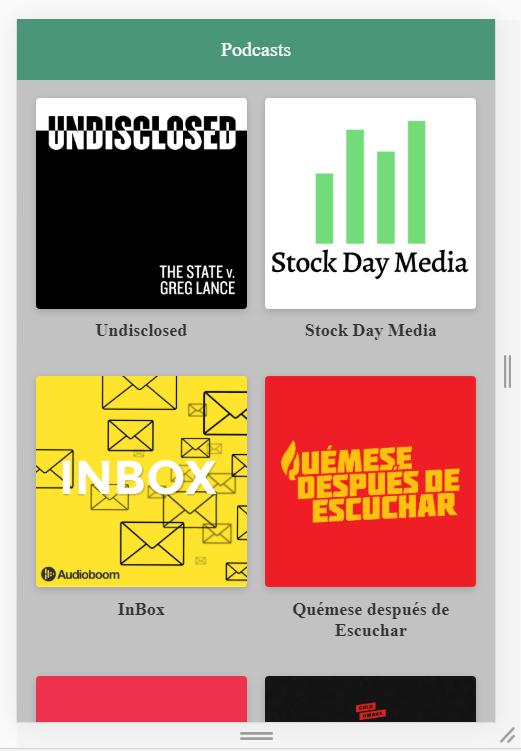

# Projycto de Next.JS - Web de podcast

Este repositorio contiene todo el contenido del proyecto.
Es una app de podcast integrada con AudioBoom usando su API.
*Gran curso de Plazti.

[Ver la applicacion:](https://nextjs.ramirodaccorso.now.sh/)
## ¿Como funciona?

    Requiere: Next Version 9.0.3
    Requiere: next-routes Version 1.4.2
    Requiere: nprogress Version 0.2.0
    Requiere: react Version 16.6.0
    Requiere: react-dom Version 16.6.0"
    Requiere: react-icons Version 3.8.0
    Requiere: slugify Version 1.3.5
    Requiere: es6-promise Version 4.2.8
    Requiere: isomorphic-fetch Version 2.2.1

* `npm install` para instalar las dependencias.
* `npm run dev` para levantar el entorno de desarrollo.
* `npm run build && npm start` para el entorno de producion

## Licencia
MIT

## Personal info.
* Desarrollo por Ramiro D'Accorso
* https://www.linkedin.com/in/irnias/
* https://twitter.com/Irnias